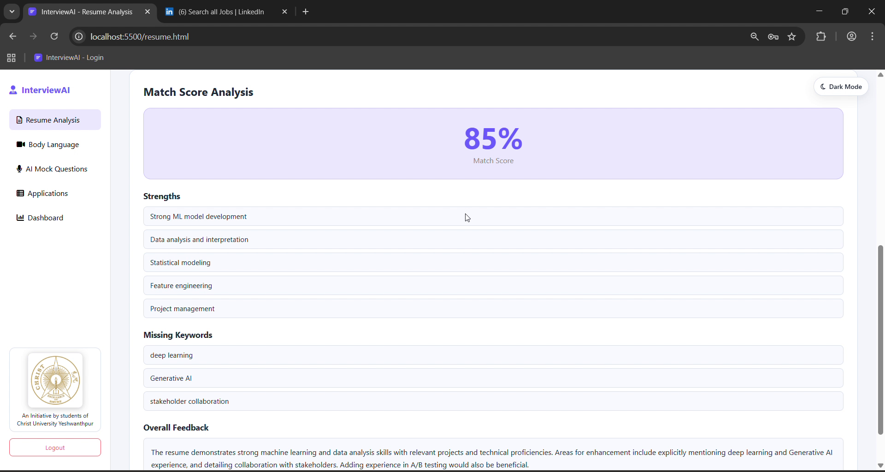
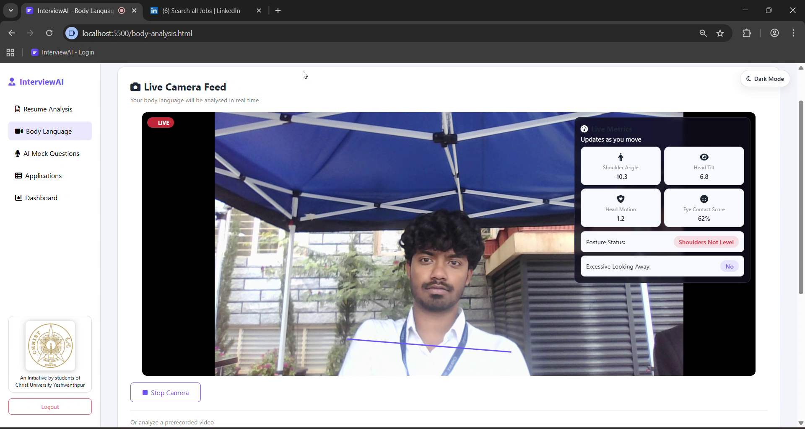
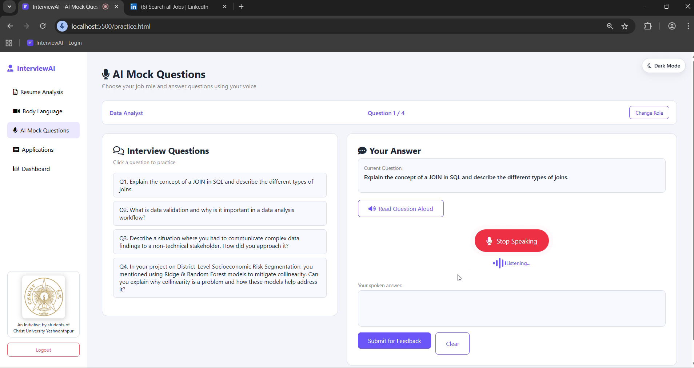
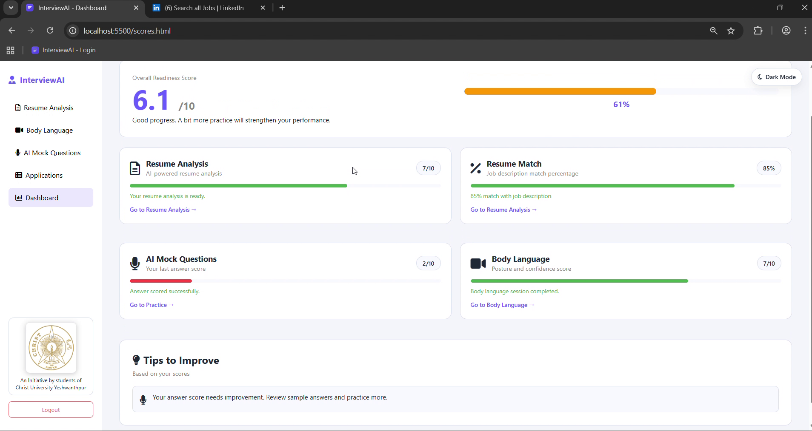

# InterviewAI

InterviewAI is a full-stack interview platform for student prep with four integrated modules:

- **Resume Analysis** (AI review + job-description match score)
- **AI Mock Questions** (role-based interview questions + answer evaluation)
- **Body Language Analysis** (live camera + uploaded video posture/eye-contact scoring)
- **Applications Tracker** (editable application table with CSV import/export)

The app uses a **static HTML/CSS/JS frontend**, **Firebase (Auth + Firestore)** for user/session data, and a **Flask backend** for AI/model-driven analysis.

---

## Demo

### AI Resume Analysis, Body Language Analysis, Mock Interview & Dashboard

Here is a snapshot of the AI-powered mock interview session and the performance dashboard.







---

## 1) Architecture Overview

### High-level flow

```text
Browser (HTML/CSS/JS)
  ├─ Firebase Auth (login/signup)
  ├─ Firestore (scores, sessions, tracker data)
  └─ Flask API (127.0.0.1:5001)
       ├─ Resume analysis endpoints
       ├─ Practice interview endpoints
       └─ Body language endpoints
            ├─ OpenCV + MediaPipe inference
            └─ Summary scoring

Flask also calls Gemini APIs (google-generativeai) with key failover.
```

### Module boundaries

- **Frontend (client-side)**
  - Authentication and page routing guard
  - Voice recording / speech recognition for practice answers
  - Live metrics overlay for body-language view
  - UI rendering and persistence triggers to Firestore
- **Backend (Flask)**
  - Resume parsing (PDF/DOCX + image fallback)
  - Gemini prompt orchestration and response normalization
  - Practice Q&A generation and scoring logic
  - Body-language frame/video processing and session summary
- **Firebase**
  - **Auth:** email/password + Google sign-in
  - **Firestore:** user profile, sessions, latest score snapshots, application tracker

---

## 2) Tech Stack

### Frontend

- HTML5 pages (`index.html`, `signup.html`, `resume.html`, `practice.html`, `body-analysis.html`, `applications.html`, `scores.html`)
- Vanilla JavaScript modules in `js/`
- CSS in `css/style.css`
- Firebase JS SDK (CDN): Auth + Firestore (+ Storage initialized)
- Browser APIs:
  - `SpeechRecognition` / `webkitSpeechRecognition`
  - `speechSynthesis`
  - `getUserMedia` for camera

### Backend

- Python + Flask
- AI/model + parsing:
  - `google-generativeai`
  - `PyPDF2`
  - `pdf2image`
  - `python-docx`
  - `PyMuPDF` (`fitz`)
- CV/body language:
  - `opencv-python`
  - `mediapipe`
  - `numpy`
- Infra/util:
  - `firebase-admin`
  - `python-dotenv`

---

## 3) Local Setup

To run the application locally, you need to configure both the backend and frontend with your Firebase project credentials.

### Backend (Python/Flask)

1.  Go to your Firebase project settings.
2.  Navigate to "Service accounts" and generate a new private key.
3.  This will download a JSON file. Rename it to `firebase_key.json` and place it in the root of the project directory.

**Important:** `firebase_key.json` is listed in `.gitignore` and should never be committed to a public repository.

### Frontend (JavaScript)

1.  In the `js/` directory, create a new file named `env.js`.
2.  Go to your Firebase project settings.
3.  Under "General", find your web app configuration.
4.  Copy the `firebaseConfig` object and paste it into `js/env.js`. The file should look like this:

    ```javascript
    const firebaseConfig = {
      apiKey: "YOUR_API_KEY",
      authDomain: "YOUR_AUTH_DOMAIN",
      projectId: "YOUR_PROJECT_ID",
      storageBucket: "YOUR_STORAGE_BUCKET",
      messagingSenderId: "YOUR_MESSAGING_SENDER_ID",
      appId: "YOUR_APP_ID",
      measurementId: "YOUR_MEASUREMENT_ID"
    };

    export { firebaseConfig };
    ```

**Important:** `js/env.js` is also listed in `.gitignore` and should not be committed.

---

## 4) Repository Structure

```text
InterviewAI/
├─ resume.py                       # Main Flask app (all core API routes)
├─ practice_interview_service.py   # Gemini tool-calling + Firestore session persistence
├─ body_language.py                # MediaPipe/OpenCV posture & eye-contact analysis
├─ requirements.txt                # Python dependency snapshot for local setup
├─ firebase_key.json               # Service account key (local use; do not commit in public repos)
├─ applications_tracker.csv        # Default template for applications table
│
├─ index.html                      # Login page
├─ signup.html                     # Signup page
├─ resume.html                     # Resume module UI
├─ practice.html                   # Mock interview UI
├─ body-analysis.html              # Body-language module UI
├─ applications.html               # Application tracker UI
├─ scores.html                     # Dashboard UI
│
├─ js/
│  ├─ firebase-config.js           # Firebase web config + service exports
│  ├─ auth.js                      # Login/signup/google auth logic
│  ├─ resume.js                    # Resume upload + result rendering
│  ├─ practice.js                  # Interview flow + speech + feedback + save session
│  ├─ body-analysis.js             # Camera/upload video analysis + live metrics + save score
│  ├─ applications.js              # Editable tracker with CSV import/export + autosave
│  ├─ scores.js                    # Dashboard score aggregation + improvement tips
│  └─ theme-toggle.js              # Theme behavior
│
├─ css/
│  └─ style.css                    # Shared app styling
│
├─ assets/                         # Logos/favicon/images
└─ __pycache__/
```

---

## 4) Backend API Endpoints

Base URL: `http://127.0.0.1:5001`

### Health

- `GET /health`
  - Returns API health and active services.

### Resume

- `POST /scan-resume`
  - Form-data:
    - `resume` (PDF or DOCX)
    - `type` = `review` or `match`
    - `job_description` (optional text)
  - Returns:
    - review mode: `{ rating, strengths[], weaknesses[], feedback }`
    - match mode: `{ percentage, missing_keywords[], strengths[], feedback }`

- `POST /upload-resume`
  - Form-data:
    - `resume` (PDF)
  - Returns extracted text: `{ resume_text }`

### Practice Interview

- `POST /generate-questions`
  - JSON: `{ role, resume_text, count }`
  - Returns: `{ questions: string[] }`

- `POST /evaluate-answer`
  - JSON: `{ role, question, answer }`
  - Returns: `{ score, strengths[], improvements[], feedback, sample_answer }`

- `POST /save-session`
  - JSON payload includes `student_id`, `questions[]`, `answers[]`, `scores[]`, etc.
  - Persists full session into Firestore and updates `practiceScore`.

### Body Language

- `POST /analyze-body`
  - Multipart with either:
    - `frame` (image bytes) for live frame scoring, optionally `sessionId`
    - `video` (uploaded video file) for full-video summary

- `POST /end-body-session`
  - JSON: `{ sessionId }`
  - Releases backend detector resources for that live session.

- `POST /summarize-body-session`
  - JSON: `{ metrics: [...] }`
  - Returns aggregate body-language score + tips.

---

## 5) Data Model (Firestore)

Collections/documents used by the app:

- `students/{uid}`
  - profile and latest score snapshots such as:
    - `resumeRating`
    - `resumeMatch`
    - `practiceScore`
    - `bodyScore`
    - strengths/weakness arrays and timestamps

- `students/{uid}/sessions/{sessionId}`
  - module-specific historical sessions:
    - resume analysis sessions
    - mock interview sessions
    - body-language sessions

- `students/{uid}/applicationTracker/main`
  - tracker schema + rows:
    - `columns: string[]`
    - `rows: object[]`

---

## 6) Environment Variables

Create a `.env` file in the project root (same folder as `resume.py`):

```env
# Gemini (at least one key required)
GOOGLE_API_KEY_MAIN=your_primary_key
GOOGLE_API_KEY_FALLBACK=your_fallback_key
# Optional legacy key path
GOOGLE_API_KEY=your_optional_legacy_key

# Firebase Admin SDK service account for backend writes
FIREBASE_SERVICE_ACCOUNT_PATH=./firebase_key.json
# or
# GOOGLE_APPLICATION_CREDENTIALS=./firebase_key.json
```

Notes:

- `resume.py` and `practice_interview_service.py` support Gemini key failover.
- Backend Firestore writes (`save-session`) require `firebase-admin` + service-account credentials.

---

## 7) Local Setup Guide (Windows)

### Prerequisites

- Python 3.10+ recommended
- `pip` and virtual environment support
- Modern browser (Chrome recommended for speech recognition)
- Internet access for:
  - Gemini API calls
  - Firebase services
  - MediaPipe model downloads (first run)

### Step A — Create and activate a virtual environment

PowerShell:

```powershell
python -m venv .venv
.\.venv\Scripts\Activate.ps1
```

### Step B — Install Python dependencies

```powershell
python -m pip install --upgrade pip
pip install -r requirements.txt
```

If `pdf2image` fails on Windows PDFs, install Poppler and add it to `PATH`.

Alternative (minimal install for only this app's core runtime):

```powershell
pip install flask python-dotenv numpy opencv-python mediapipe==0.10.31 pdf2image PyPDF2 python-docx pymupdf google-generativeai protobuf firebase-admin
```

### Step C — Configure env vars

1. Create `.env` in project root.
2. Add Gemini keys and Firebase credential path (see section 6).

### Step D — Run Flask backend

```powershell
python resume.py
```

Backend starts at `http://127.0.0.1:5001`.

### Step E — Serve frontend static files

From project root, open a second terminal:

```powershell
python -m http.server 5500
```

Then open:

`http://localhost:5500/index.html`

---

## 8) How to Use

1. **Sign up / Login** (`index.html` / `signup.html`)
2. **Resume Analysis** (`resume.html`)
   - Upload PDF/DOCX
   - Run `Review Resume` or `Match Score`
3. **AI Mock Questions** (`practice.html`)
   - Choose role + upload resume PDF
   - Generate questions, answer via microphone, submit for scoring
4. **Body Language** (`body-analysis.html`)
   - Start camera for live analysis or upload a recorded video
   - Receive score + tips and store results
5. **Applications Tracker** (`applications.html`)
   - Track companies/roles/status, import/export CSV
6. **Dashboard** (`scores.html`)
   - View module scores and overall readiness

---

## 9) Security and Deployment Notes

- `js/firebase-config.js` currently contains a concrete Firebase config object. For production hardening:
  - restrict Firebase API key usage to authorized domains,
  - secure Firestore rules,
  - avoid exposing unnecessary project settings.
- Never commit private service-account JSON to public repositories.
- `resume.py` currently runs with `debug=True`; switch to production WSGI setup (Gunicorn/Waitress) before deployment.

---

## 10) Troubleshooting

- **`Gemini API key missing`**
  - Ensure `.env` is present and has at least one valid key.

- **Resume parsing issues with PDFs**
  - Some scanned PDFs require image fallback/OCR-like handling.
  - Ensure `pdf2image` dependencies (Poppler) are available.

- **Speech recognition not working**
  - Use Chrome/Edge and allow microphone permission.

- **Camera fails to start**
  - Check browser camera permissions.
  - Ensure no other app is locking the webcam.

- **Firestore save errors in backend**
  - Confirm `FIREBASE_SERVICE_ACCOUNT_PATH` points to a valid service account JSON.

---

## 11) Optional: Body Language Standalone Modes

`body_language.py` also supports:

- CLI mode (webcam/video processing)
- Flask service mode:

```powershell
python body_language.py --serve
```

This starts an additional body-language-only API on port `5001`.

---


## 12) Suggested Next Improvements

- Create a curated `requirements.txt` (or split into `requirements.txt` + `requirements-dev.txt`) with only project dependencies.
- Move API base URL to a single environment-driven frontend config.
- Add CI checks (lint + smoke tests).
- Add structured logging and error monitoring.
- Add containerized deployment (`Dockerfile` + compose).

---

